# Webserv

A fully functional HTTP/1.1 server implemented in C++98 for the 42 school Webserv project.

## Table of Contents

- [Features](#features)
- [Configuration](#configuration)
- [Testing](#testing)
- [Project Structure](#project-structure)
- [Compliance](#compliance)
- [Architecture & Timeline](#architecture--timeline)

## Features

### Core HTTP Features
- **HTTP/1.1 support** with proper request parsing and response generation
- **GET, POST, DELETE methods** fully implemented
- **Keep-alive connections** for HTTP/1.1 (persistent connections)
- **Chunked transfer encoding** support for request bodies
- **Proper status codes** and error handling

### Server Features
- **Non-blocking I/O** using `poll()` for all socket operations
- **Multiple virtual hosts** on the same port (differentiated by Host header)
- **Multiple ports** support for different server configurations
- **Configurable timeouts** for client connections and CGI processes
- **Graceful shutdown** with signal handling (SIGINT, SIGTERM)

### Static Content
- **Static file serving** with proper MIME type detection
- **Directory listing** (autoindex) when enabled
- **Custom error pages** (404, 500, etc.)
- **File uploads** with multipart/form-data support

### CGI Support
- **CGI execution** for dynamic content (Python, Shell, etc.)
- **Environment variables** properly set according to CGI/1.1 spec
- **POST body passing** to CGI scripts
- **Timeout handling** for long-running CGI processes

### Configuration
- **NGINX-inspired configuration** file format
- **Per-location settings** (root, index, methods, CGI, redirects)
- **Client body size limits** to prevent abuse
- **Custom error pages** per server

If no config file is specified, `config/default.conf` is used.

## Configuration

The configuration file uses an NGINX-inspired syntax:

```nginx
server {
    listen 8080;
    server_name localhost;
    root ./www/html;
    index index.html;
    client_max_body_size 10M;
    
    # Custom error pages
    error_page 404 /errors/404.html;
    
    location / {
        methods GET POST;
        autoindex on;
    }
    
    location /upload {
        methods GET POST DELETE;
        root ./www/uploads;
        upload_store ./www/uploads;
    }
    
    location /cgi-bin {
        methods GET POST;
        root ./www/cgi-bin;
        cgi .py /usr/bin/python3;
    }
    
    location /redirect {
        return 301 http://example.com;
    }
}
```

### Configuration Directives

#### Server Block
- `listen` - Port to listen on (format: `[host:]port`)
- `server_name` - Server names for virtual hosting
- `root` - Document root directory
- `index` - Default index file
- `client_max_body_size` - Maximum request body size (supports K, M, G suffixes)
- `error_page` - Custom error page for a status code

#### Location Block
- `root` - Override server root for this location
- `methods` - Allowed HTTP methods
- `autoindex` - Enable directory listing (on/off)
- `index` - Default index file for this location
- `upload_store` - Directory for file uploads
- `cgi` - CGI handler (format: `.extension /path/to/interpreter`)
- `return` - HTTP redirect (format: `code url`)

## Testing

### Manual Testing with curl

```bash
# GET request
curl http://localhost:8080/

# POST request with data
curl -X POST -d "key=value" http://localhost:8080/

# File upload
curl -X POST -F "file=@/path/to/file" http://localhost:8080/upload

# DELETE request
curl -X DELETE http://localhost:8080/upload/filename

# CGI test
curl http://localhost:8080/cgi-bin/test.py

# Virtual host test
curl --resolve site.com:8080:127.0.0.1 http://site.com:8080/
```

### Stress Testing with siege

```bash
siege -b -t 60s http://localhost:8080/
```

## Project Structure

```
webserv/
├── src/
│   ├── main.cpp              # Entry point
│   ├── config/               # Configuration parsing
│   │   ├── Config.cpp
│   │   ├── ConfigParser.cpp
│   │   ├── ServerConfig.cpp
│   │   └── LocationConfig.cpp
│   ├── server/               # Server core
│   │   ├── Server.cpp
│   │   ├── Socket.cpp
│   │   ├── Client.cpp
│   │   └── EventLoop.cpp
│   ├── http/                 # HTTP protocol
│   │   ├── HttpRequest.cpp
│   │   ├── HttpResponse.cpp
│   │   ├── HttpParser.cpp
│   │   ├── MimeTypes.cpp
│   │   └── RequestHandler.cpp
│   ├── cgi/                  # CGI support
│   │   └── CgiHandler.cpp
│   └── utils/                # Utilities
│       ├── Utils.cpp
│       └── Logger.cpp
├── include/                  # Header files
├── config/                   # Configuration files
├── www/                      # Web content
│   ├── html/                 # Static files
│   ├── errors/               # Error pages
│   ├── uploads/              # Upload directory
│   └── cgi-bin/              # CGI scripts
└── Makefile
```

## Compliance

This implementation follows the 42 school Webserv project requirements:

- ✅ Compiles with `-Wall -Wextra -Werror -std=c++98`
- ✅ Single `poll()` instance for all I/O operations
- ✅ Non-blocking I/O on all sockets and pipes
- ✅ No `errno` checking after read/write operations
- ✅ Proper handling of both `-1` and `0` return values
- ✅ Only one read/write per client per poll iteration
- ✅ `fork()` only used for CGI execution
- ✅ Supports GET, POST, DELETE methods
- ✅ Can serve static websites
- ✅ File upload support
- ✅ CGI support (Python)
- ✅ Multiple ports with different configurations
- ✅ Custom error pages
- ✅ Directory listing (autoindex)
- ✅ HTTP redirects
- ✅ Client body size limits

## Architecture & Timeline

The following diagram illustrates the project's 8-phase development timeline with task dependencies and team assignments:

```mermaid
%%{init: {'theme': 'base', 'themeVariables': { 'primaryColor': '#e1f5fe', 'primaryTextColor': '#01579b', 'primaryBorderColor': '#0288d1', 'lineColor': '#424242', 'secondaryColor': '#fff3e0', 'tertiaryColor': '#f3e5f5'}}}%%

flowchart TD
    subgraph Phase0["Phase 0: Foundation & Setup (Days 0-7)"]
        A1["<b>A1</b><br/>Project Structure Setup<br/>Duration: 2d | Float: 0<br/>All Team"]
        A2["<b>A2</b><br/>Makefile Creation<br/>Duration: 1d | Float: 0<br/>All Team"]
        A3["<b>A3</b><br/>Master Header File<br/>Duration: 1d | Float: 0<br/>All Team"]
        A4["<b>A4</b><br/>Interface Definition Meeting<br/>Duration: 1d | Float: 0<br/>All Team"]
        A5["<b>A5</b><br/>HTTP/1.1 RFC Research<br/>Duration: 3d | Float: 0<br/>Student 3"]
        A6["<b>A6</b><br/>NGINX Config Study<br/>Duration: 3d | Float: 2<br/>Student 1"]
        A7["<b>A7</b><br/>System Calls Research<br/>Duration: 3d | Float: 0<br/>Student 2"]
    end

    subgraph Phase1["Phase 1: Configuration System (Days 7-19)"]
        B1["<b>B1</b><br/>LocationConfig Class<br/>Duration: 2d | Float: 2<br/>Student 1"]
        B2["<b>B2</b><br/>ServerConfig Class<br/>Duration: 2d | Float: 2<br/>Student 1"]
        B3["<b>B3</b><br/>Config Container Class<br/>Duration: 1d | Float: 2<br/>Student 1"]
        B4["<b>B4</b><br/>ConfigParser - Tokenizer<br/>Duration: 2d | Float: 0<br/>Student 1"]
        B5["<b>B5</b><br/>ConfigParser - Blocks<br/>Duration: 3d | Float: 0<br/>Student 1"]
        B6["<b>B6</b><br/>Config Validation Logic<br/>Duration: 2d | Float: 0<br/>Student 1"]
        B7["<b>B7</b><br/>Default Error Pages<br/>Duration: 1d | Float: 3<br/>Student 1"]
    end

    subgraph Phase2["Phase 2: Core Server - CRITICAL (Days 7-27)"]
        C1["<b>C1</b><br/>Socket Utilities Class<br/>Duration: 2d | Float: 0<br/>Student 2"]
        C2["<b>C2</b><br/>Client State Machine<br/>Duration: 1d | Float: 0<br/>Student 2"]
        C3["<b>C3</b><br/>Client Class Implementation<br/>Duration: 3d | Float: 0<br/>Student 2"]
        C4["<b>C4</b><br/>EventLoop - Data Structures<br/>Duration:  2d | Float: 0<br/>Student 2"]
        C5["<b>C5</b><br/>EventLoop - Main poll() Loop<br/>Duration: 4d | Float: 0<br/>Student 2"]
        C6["<b>C6</b><br/>EventLoop - Client Read<br/>Duration: 2d | Float: 0<br/>Student 2"]
        C7["<b>C7</b><br/>EventLoop - Client Write<br/>Duration: 2d | Float: 0<br/>Student 2"]
        C8["<b>C8</b><br/>Timeout & Cleanup<br/>Duration: 2d | Float: 0<br/>Student 2"]
        C9["<b>C9</b><br/>Server Class & Signals<br/>Duration: 2d | Float: 0<br/>Student 2"]
    end

    subgraph Phase3["Phase 3: HTTP Protocol (Days 7-23)"]
        D1["<b>D1</b><br/>HttpRequest Class<br/>Duration: 2d | Float: 3<br/>Student 3"]
        D2["<b>D2</b><br/>HttpParser State Machine<br/>Duration: 1d | Float: 3<br/>Student 3"]
        D3["<b>D3</b><br/>HttpParser - Request Line<br/>Duration: 2d | Float: 3<br/>Student 3"]
        D4["<b>D4</b><br/>HttpParser - Headers<br/>Duration: 3d | Float: 3<br/>Student 3"]
        D5["<b>D5</b><br/>HttpParser - Body<br/>Duration: 2d | Float: 3<br/>Student 3"]
        D6["<b>D6</b><br/>HttpParser - Chunked<br/>Duration: 3d | Float: 3<br/>Student 3"]
        D7["<b>D7</b><br/>HttpResponse Class<br/>Duration: 2d | Float: 10<br/>Student 3"]
        D8["<b>D8</b><br/>MimeTypes Implementation<br/>Duration: 1d | Float: 10<br/>Student 3"]
    end

    subgraph Phase4["Phase 4: Request Handling (Days 27-37)"]
        E1["<b>E1</b><br/>Request Router Integration<br/>Duration: 2d | Float: 0<br/>Student 1"]
        E2["<b>E2</b><br/>Virtual Host Resolution<br/>Duration: 2d | Float: 0<br/>Student 1"]
        E3["<b>E3</b><br/>URL/Path Security Utils<br/>Duration: 2d | Float: 0<br/>Student 1"]
        E4["<b>E4</b><br/>RequestHandler - Router<br/>Duration: 2d | Float: 0<br/>Student 3"]
        E5["<b>E5</b><br/>GET Handler (Static)<br/>Duration: 2d | Float: 0<br/>Student 3"]
        E6["<b>E6</b><br/>Directory Listing<br/>Duration: 2d | Float: 0<br/>Student 3"]
        E7["<b>E7</b><br/>POST Handler (Upload)<br/>Duration: 3d | Float: 0<br/>Student 3"]
        E8["<b>E8</b><br/>DELETE Handler<br/>Duration: 1d | Float: 0<br/>Student 3"]
    end

    subgraph Phase5["Phase 5: CGI Implementation (Days 27-38)"]
        F1["<b>F1</b><br/>CGI Handler - Fork/Exec<br/>Duration: 3d | Float: 3<br/>Student 3"]
        F2["<b>F2</b><br/>CGI Environment Vars<br/>Duration: 2d | Float: 3<br/>Student 3"]
        F3["<b>F3</b><br/>CGI I/O in Event Loop<br/>Duration: 2d | Float: 3<br/>Student 2"]
        F4["<b>F4</b><br/>CGI Output Parser<br/>Duration: 2d | Float: 3<br/>Student 3"]
        F5["<b>F5</b><br/>CGI Timeout Handling<br/>Duration: 1d | Float: 3<br/>Student 2"]
    end

    subgraph Phase6["Phase 6: Integration & Testing (Days 33-45)"]
        G1["<b>G1</b><br/>Config + Server Integration<br/>Duration: 2d | Float: 2<br/>Student 1, 2"]
        G2["<b>G2</b><br/>Parser + EventLoop Integration<br/>Duration: 2d | Float: 0<br/>Student 2, 3"]
        G3["<b>G3</b><br/>Full System Integration<br/>Duration: 2d | Float: 0<br/>All Team"]
        G4["<b>G4</b><br/>Unit Test Creation<br/>Duration: 3d | Float: 1<br/>All Team"]
        G5["<b>G5</b><br/>Stress Testing (siege)<br/>Duration: 2d | Float: 0<br/>Student 2"]
        G6["<b>G6</b><br/>Memory Leak Testing<br/>Duration: 2d | Float: 0<br/>All Team"]
    end

    subgraph Phase7["Phase 7: Robustness & Docs (Days 45-53)"]
        H1["<b>H1</b><br/>Bug Fixes from Testing<br/>Duration: 3d | Float: 0<br/>All Team"]
        H2["<b>H2</b><br/>Code Review & Cleanup<br/>Duration: 2d | Float: 0<br/>All Team"]
        H3["<b>H3</b><br/>Sample Config Files<br/>Duration: 1d | Float: 0<br/>Student 1"]
        H4["<b>H4</b><br/>Test CGI Scripts<br/>Duration: 1d | Float: 0<br/>Student 3"]
        H5["<b>H5</b><br/>Documentation Update<br/>Duration: 2d | Float: 0<br/>All Team"]
    end

    subgraph Phase8["Phase 8: Final Preparation (Days 53-58)"]
        I1["<b>I1</b><br/>Evaluation Checklist<br/>Duration: 2d | Float: 0<br/>All Team"]
        I2["<b>I2</b><br/>Final Stress Test<br/>Duration: 1d | Float: 0<br/>Student 2"]
        I3["<b>I3</b><br/>Presentation Prep<br/>Duration: 2d | Float: 0<br/>All Team"]
    end

    %% Phase 0 Dependencies
    A1 --> A2
    A1 --> A3
    A2 --> A4
    A3 --> A4
    A4 --> A5
    A4 --> A6
    A4 --> A7

    %% Phase 1 Dependencies
    A6 --> B1
    B1 --> B2
    B2 --> B3
    B2 --> B4
    B4 --> B5
    B3 --> B6
    B5 --> B6
    B6 --> B7

    %% Phase 2 Dependencies (Critical Path)
    A7 --> C1
    C1 --> C2
    C2 --> C3
    C3 --> C4
    C4 --> C5
    C5 --> C6
    C6 --> C7
    C7 --> C8
    C8 --> C9

    %% Phase 3 Dependencies
    A5 --> D1
    D1 --> D2
    D2 --> D3
    D3 --> D4
    D4 --> D5
    D5 --> D6
    D1 --> D7
    D7 --> D8

    %% Phase 4 Dependencies
    B6 --> E1
    C9 --> E1
    E1 --> E2
    E2 --> E3
    C9 --> E4
    D6 --> E4
    E4 --> E5
    E5 --> E6
    E6 --> E7
    E7 --> E8

    %% Phase 5 Dependencies
    C9 --> F1
    F1 --> F2
    F1 --> F3
    F2 --> F4
    F3 --> F5
    F4 --> F5

    %% Phase 6 Dependencies
    E3 --> G1
    C9 --> G1
    E8 --> G2
    D6 --> G2
    G1 --> G3
    G2 --> G3
    G3 --> G4
    G3 --> G5
    G5 --> G6

    %% Phase 7 Dependencies
    G6 --> H1
    H1 --> H2
    H2 --> H3
    H2 --> H4
    H3 --> H5
    H4 --> H5

    %% Phase 8 Dependencies
    H5 --> I1
    I1 --> I2
    I2 --> I3

    %% Styling for Critical Path (Red)
    style A1 fill:#ffcdd2,stroke:#c62828,stroke-width:3px
    style A2 fill:#ffcdd2,stroke:#c62828,stroke-width:3px
    style A4 fill:#ffcdd2,stroke:#c62828,stroke-width:3px
    style A7 fill:#ffcdd2,stroke:#c62828,stroke-width:3px
    style C1 fill:#ffcdd2,stroke:#c62828,stroke-width:3px
    style C2 fill:#ffcdd2,stroke:#c62828,stroke-width:3px
    style C3 fill:#ffcdd2,stroke:#c62828,stroke-width:3px
    style C4 fill:#ffcdd2,stroke:#c62828,stroke-width:3px
    style C5 fill:#ffcdd2,stroke:#c62828,stroke-width:3px
    style C6 fill:#ffcdd2,stroke:#c62828,stroke-width: 3px
    style C7 fill:#ffcdd2,stroke:#c62828,stroke-width:3px
    style C8 fill:#ffcdd2,stroke:#c62828,stroke-width:3px
    style C9 fill:#ffcdd2,stroke:#c62828,stroke-width:3px
    style E4 fill:#ffcdd2,stroke:#c62828,stroke-width:3px
    style E5 fill:#ffcdd2,stroke:#c62828,stroke-width:3px
    style E6 fill:#ffcdd2,stroke:#c62828,stroke-width:3px
    style E7 fill:#ffcdd2,stroke:#c62828,stroke-width:3px
    style E8 fill:#ffcdd2,stroke:#c62828,stroke-width:3px
    style G2 fill:#ffcdd2,stroke:#c62828,stroke-width:3px
    style G3 fill:#ffcdd2,stroke:#c62828,stroke-width:3px
    style G5 fill:#ffcdd2,stroke:#c62828,stroke-width:3px
    style G6 fill:#ffcdd2,stroke:#c62828,stroke-width:3px
    style H1 fill:#ffcdd2,stroke:#c62828,stroke-width:3px
    style H2 fill:#ffcdd2,stroke:#c62828,stroke-width:3px
    style H5 fill:#ffcdd2,stroke:#c62828,stroke-width:3px
    style I1 fill:#ffcdd2,stroke:#c62828,stroke-width:3px
    style I2 fill:#ffcdd2,stroke:#c62828,stroke-width:3px
    style I3 fill:#ffcdd2,stroke:#c62828,stroke-width:3px

    %% Styling for Non-Critical Path (Blue/Green)
    style A3 fill:#c8e6c9,stroke:#388e3c,stroke-width: 2px
    style A5 fill:#bbdefb,stroke:#1976d2,stroke-width: 2px
    style A6 fill:#c8e6c9,stroke:#388e3c,stroke-width:2px
    style B1 fill:#c8e6c9,stroke:#388e3c,stroke-width:2px
    style B2 fill:#c8e6c9,stroke:#388e3c,stroke-width:2px
    style B3 fill:#c8e6c9,stroke:#388e3c,stroke-width:2px
    style B4 fill:#c8e6c9,stroke:#388e3c,stroke-width:2px
    style B5 fill:#c8e6c9,stroke:#388e3c,stroke-width:2px
    style B6 fill:#c8e6c9,stroke:#388e3c,stroke-width:2px
    style B7 fill:#c8e6c9,stroke:#388e3c,stroke-width:2px
    style D1 fill:#bbdefb,stroke:#1976d2,stroke-width:2px
    style D2 fill:#bbdefb,stroke:#1976d2,stroke-width:2px
    style D3 fill:#bbdefb,stroke:#1976d2,stroke-width: 2px
    style D4 fill:#bbdefb,stroke:#1976d2,stroke-width:2px
    style D5 fill:#bbdefb,stroke:#1976d2,stroke-width:2px
    style D6 fill:#bbdefb,stroke:#1976d2,stroke-width:2px
    style D7 fill:#bbdefb,stroke:#1976d2,stroke-width:2px
    style D8 fill:#bbdefb,stroke:#1976d2,stroke-width:2px
    style E1 fill:#c8e6c9,stroke:#388e3c,stroke-width:2px
    style E2 fill:#c8e6c9,stroke:#388e3c,stroke-width:2px
    style E3 fill:#c8e6c9,stroke:#388e3c,stroke-width:2px
    style F1 fill:#bbdefb,stroke:#1976d2,stroke-width:2px
    style F2 fill:#bbdefb,stroke:#1976d2,stroke-width:2px
    style F3 fill:#fff3e0,stroke:#f57c00,stroke-width:2px
    style F4 fill:#bbdefb,stroke:#1976d2,stroke-width:2px
    style F5 fill:#fff3e0,stroke:#f57c00,stroke-width:2px
    style G1 fill:#e1bee7,stroke:#7b1fa2,stroke-width: 2px
    style G4 fill:#e1bee7,stroke:#7b1fa2,stroke-width:2px
    style H3 fill:#c8e6c9,stroke:#388e3c,stroke-width:2px
    style H4 fill:#bbdefb,stroke:#1976d2,stroke-width:2px
```



### Legend

- 🔴 **Red nodes**: Critical path tasks (must be completed on time)
- 🟢 **Green nodes**: Configuration system tasks (Student 1)
- 🔵 **Blue nodes**: HTTP protocol tasks (Student 3)
- 🟠 **Orange nodes**: CGI integration with event loop (Students 2 & 3)
- 🟣 **Purple nodes**: Integration tasks (Multiple students)

### Project Phases Overview

1. **Phase 0 (Days 0-7)**: Foundation & Setup - Project structure, research, and planning
2. **Phase 1 (Days 7-19)**: Configuration System - NGINX-inspired config parser
3. **Phase 2 (Days 7-27)**: Core Server - Event loop, non-blocking I/O, socket management ⚠️ Critical
4. **Phase 3 (Days 7-23)**: HTTP Protocol - Request/response parsing and handling
5. **Phase 4 (Days 27-37)**: Request Handling - GET, POST, DELETE methods
6. **Phase 5 (Days 27-38)**: CGI Implementation - Dynamic content execution
7. **Phase 6 (Days 33-45)**: Integration & Testing - System integration and stress testing
8. **Phase 7 (Days 45-53)**: Robustness & Documentation - Bug fixes and docs
9. **Phase 8 (Days 53-58)**: Final Preparation - Evaluation readiness

---

## Getting Started

### Prerequisites

- C++98 compliant compiler (g++ or clang++)
- Make
- Python 3 (for CGI testing)
- siege (optional, for stress testing)

### Building

```bash
make
```

### Running

```bash
# With default config
./webserv

# With custom config
./webserv config/custom.conf
```

### Cleaning

```bash
make clean    # Remove object files
make fclean   # Remove object files and executable
make re       # Rebuild from scratch
```