# Project Plan: Phases 0-3

**Goal:** Establish a non-blocking HTTP server capable of accepting connections, parsing configs, and handling basic GET requests.

**Project Duration:** Days 0-27  
**Team Size:** 3 Students

---

## Table of Contents

1. [Roles](#1-roles)
2. [Quick Reference: Key Evaluation Requirements](#2-quick-reference-key-evaluation-requirements)
3. [File Implementation Details](#3-file-implementation-details)
4. [The Plan (Dependency Diagram)](#4-the-plan)
5. [Milestone Checkpoints](#5-milestone-checkpoints)

---

## 1. Roles

### Student 1: Configuration

**Focus:** Configuration parsing, Validation, Data Structures.  
**Goal:** Your code runs first. You read the file, ensure the server settings are valid, and provide a lookup mechanism so the other students know which port to open and where files live.

  
Details

### Phase 0: Research

#### **Task A6: NGINX Config Study**

- **The Purpose:** The subject explicitly states the configuration file is "inspired by NGINX." You cannot build a parser if you don't understand the grammar.
- **The Goal:** Understand the hierarchy of blocks.
  - Understand **Contexts**: What allows a directive to be in a `server` block vs a `location` block?
  - Understand **Inheritance**: If `root` is defined in `server`, does it apply to all `location` blocks inside it?
  - Understand **Routing**: How does NGINX decide which `location` block matches a URL like `/images/logo.png`?
- **Deliverable:** A sample `.conf` file that you intend to support, covering all mandatory subject requirements (ports, hosts, roots, indexes, error pages, body size, methods).

---

### Phase 1: Configuration System

#### **Task B1: LocationConfig Class**

- **The Purpose:** This represents the specific rules for a URL path (e.g., `/api` or `/uploads`). It is the most granular level of configuration.
- **The Goal:** Create a C++ class that holds settings for a specific route.
  - It needs to store: Allowed methods (GET/POST), the root directory for this specific path, whether directory listing (autoindex) is on/off, and where to save uploaded files.
- **Definition of Done:** A class with private members and public getters/setters. No parsing logic yet, just a storage container.

#### **Task B2: ServerConfig Class**

- **The Purpose:** This represents a "Virtual Host." A physical server can host `example.com` and `test.com` on the same port, or on different ports. This class represents one of those entities.
- **The Goal:** Create a C++ class that holds server-wide settings.
  - It needs to store: Port number, Host (IP address), Server Names (domain names), and a list (vector) of `LocationConfig` objects (from B1).
- **Definition of Done:** A class that can hold data for one `server { ... }` block, including a container for its nested locations.

#### **Task B3: Config Container Class**

- **The Purpose:** Your program needs a central object to hold all the server configurations found in the file.
- **The Goal:** Create a main `Config` class.
  - It essentially holds a `vector<ServerConfig>`.
  - It acts as the API for Student 2 and 3. They will ask this class: "I received a request for port 8080 with host header 'google.com', which ServerConfig do I use?"
- **Definition of Done:** The entry point class that Student 2 will instantiate in `main.cpp`.

#### **Task B4: ConfigParser - Tokenizer**

- **The Purpose:** Reading a file character-by-character is messy and bug-prone. It is much easier to process a file if you first break it into "words" (tokens).
- **The Goal:** Write a function that reads the raw text file and splits it into a `vector<string>`.
  - It should treat special characters like `{`, `}`, and `;` as separate tokens.
  - It should strip out comments (`#`) and extra whitespace.
- **Definition of Done:** Input: `server { listen 80; }`. Output Vector: `["server", "{", "listen", "80", ";", "}"]`.

#### **Task B5: ConfigParser - Blocks**

- **The Purpose:** Now that you have a list of tokens, you need to give them meaning and structural hierarchy.
- **The Goal:** Implement the logic that iterates through your tokens and fills the classes created in B1, B2, and B3.
  - It detects when a `server` block starts and creates a new `ServerConfig`.
  - It detects when a `location` block starts and creates a new `LocationConfig`.
  - It handles the nesting (Location is _inside_ Server).
- **Definition of Done:** You can pass a filepath to your parser, and it returns a fully populated `Config` object with all data correctly structure.

#### **Task B6: Config Validation Logic**

- **The Purpose:** Users make mistakes. They might set a port to `-1`, or set a root directory that doesn't exist. If you let bad config data through, the server will crash later (Task C1/C5).
- **The Goal:** Sanity check the data _after_ parsing but _before_ the server starts.
  - Check: Are ports within 0-65535?
  - Check: Do the required paths actually exist on the OS?
  - Check: Are there duplicate servers (same port + same server name)?
- **Definition of Done:** The program exits with a clean error message like `Error: Config file invalid - Duplicate port 8080` instead of Segfaulting later.

#### **Task B7: Default Error Pages**

- **The Purpose:** The subject requires that the server works even if the user provides _no_ configuration for error pages. If a 404 happens, you must show something.
- **The Goal:** Generate hardcoded HTML content.
  - If the config file doesn't specify a custom `404.html`, your code should provide a default internal string (e.g., `<html><body><h1>404 Not Found</h1></body></html>`).
- **Definition of Done:** Student 3 can ask for the "404 page content", and you return either the user's custom file content OR your default HTML string.

**Integration Points with Other Students:**

- Student 2 depends on your `Config` class to know which ports to open
- Student 3 depends on your `LocationConfig` to determine routing rules
- Your code must be ready by **Day 19** for seamless integration

---

### Student 2: Core Networking

**Focus:** Sockets, Event Loop, I/O Multiplexing (`poll`), Client State.
**Goal:** You build the engine. You are responsible for the single `poll()` loop. You ensure the server never hangs, never blocks, and can handle multiple clients simultaneously connecting via `telnet` or `nc`.

  
Details

### Phase 0: Research

#### **Task A7: System Calls Research**

- **The Purpose:** The project forbids modern networking libraries. You must understand the UNIX specification for I/O.
- **The Goal:** deeply understand **Blocking vs. Non-Blocking** I/O.
  - Understand why `read()` normally pauses your program and how `fcntl()` stops that.
  - Understand `poll()` (or `epoll/kqueue`): How to ask the OS, "Which of these 100 connections has data for me?"
  - Understand the "Three-Way Handshake" concepts (`bind`, `listen`, `accept`).
- **Deliverable:** A clear mental model (or diagram) of how a single thread can handle 10 simultaneous connections without using `threads`.

---

### Phase 2: Core Server (The Critical Path)

#### **Task C1: Socket Utilities Class**

- **The Purpose:** Raw C system calls are ugly and require complex error checking. You don't want to clutter your main logic with `struct sockaddr_in` setup code.
- **The Goal:** Create a reusable toolset to open ports.
  - Instead of writing 20 lines of C code to open a port, you want to write `Socket::listenOn(8080)`.
  - This class handles the OS boilerplate: creating the socket, setting the "Reuse Address" option (so you can restart the server instantly), and binding to the port.
- **Definition of Done:** You can open a port on your machine and see it listening using `netstat` or `lsof`.
- **Verification Command:** `lsof -i :8080` or `netstat -tlnp | grep 8080`

#### **Task C2: Client State Machine**

- **The Purpose:** A connection is not just "Open" or "Closed." It goes through phases. If you don't track these phases, you will try to read from a client that is waiting for a response, or write to a client that is uploading data.
- **The Goal:** Define the valid states of a connection.
  - **Reading:** We are waiting for the request (Header + Body).
  - **Writing:** We have the answer ready and are sending it back.
  - **Wait_CGI:** We handed off work to a script and are waiting for it to finish.
  - **Closing:** We sent the data and are cutting the connection.

#### **Task C3: Client Class Implementation**

- **The Purpose:** `poll` only gives you a File Descriptor ID (an integer). You need an object to store the _context_ associated with that integer.
- **The Goal:** Create the "Session Object."
  - It must hold: The FD, the IP address, the current State (from C2), timestamps (for timeouts), and crucially, **Buffers**.
  - _Why Buffers?_ You might read a request halfway. You need a place to store "Part 1" until "Part 2" arrives.
- **Definition of Done:** A Class that can store incoming bytes and hold outgoing bytes until they are fully sent.

#### **Task C4: EventLoop - Data Structures**

- **The Purpose:** You need a way to map the raw Integers returned by `poll` back to your nice `Client` objects from C3.
- **The Goal:** Design the memory storage.
  - You need a container (like a Map) where `Key = FileDescriptor` and `Value = ClientObject`.
  - You need a vector of `pollfd` structs to hand to the OS.
  - This structure must allow fast insertion (new connection) and deletion (disconnect).

#### **Task C5: EventLoop - Main poll() Loop**

- **The Purpose:** This is the most critical function in the entire project. It is the infinite loop that keeps the server alive.
- **The Goal:** Implement the "Reactor Pattern."
  1.  **Wait:** Call `poll()` and sleep until the OS wakes you up.
  2.  **Dispatch:** Iterate through the results. Is it a new connection? Is it data coming in? Is it space to write out?
  3.  **Route:** Call the appropriate helper functions (C6/C7).
  - Constraint: You must handle **Listening Sockets** and **Connection Sockets** in this same loop.

#### **Task C6: EventLoop - Client Read**

- **The Purpose:** The OS told you "There is data waiting." You need to move it from the OS kernel to your application memory.
- **The Goal:** Read bytes non-blockingly.
  - Read into the `Client`'s read buffer.
  - **Crucial:** Detect if the client closed the connection (read returns 0).
  - **Integration:** Once data is read, you eventually hand it to Student 3's Parser.
- **Definition of Done:** You can `telnet` to the server, type keys, and see them appear in your program's memory/logs.
- **Verification Command:** `telnet localhost 8080` then type any text

#### **Task C7: EventLoop - Client Write**

- **The Purpose:** Student 3 has generated a response (e.g., an HTML page), but you can't just dump 10MB instantly. The client might be on slow Wi-Fi.
- **The Goal:** Send what you can, pause, and resume later.
  - Check how much the OS allows you to send.
  - Send that chunk. Remove it from the buffer.
  - If there is more left, wait for the next loop iteration to send the rest.
  - If done, close the connection (or reset for Keep-Alive).

#### **Task C8: Timeout & Cleanup**

- **The Purpose:** Clients are unreliable. They lose Wi-Fi, crash, or simply stop talking. If you keep their `Client` objects in memory forever, your server will run out of RAM (Memory Leak).
- **The Goal:** Periodic Garbage Collection.
  - In every loop, check the "Last Active" timestamp of every client.
  - If it's been > 60 seconds, forcibly close the connection and delete the object.
  - Ensure no "Zombie" file descriptors are left open.

#### **Task C9: Server Class & Signals**

- **The Purpose:** Tying it all together. The server needs to start up cleanly using the Config from Student 1, and shut down cleanly when the admin presses `Ctrl+C`.
- **The Goal:** Lifecycle Management.
  - **Init:** Ask S1's Config "Which ports do I need?". Loop through them and create Listeners (C1). Add them to the EventLoop (C4).
  - **Shutdown:** Catch the `SIGINT` signal. Break the infinite loop. Close all FDs. Free all memory.
- **Definition of Done:** You can start the server with a specific config, and when you kill it, Valgrind reports **0 Memory Leaks**.
- **Verification Command:** `valgrind --leak-check=full ./webserv config/default.conf`

**Integration Points with Other Students:**

- You depend on Student 1's `Config` class for port/host information
- Student 3 depends on your `EventLoop` to call their HTTP parser
- Your event loop is the **critical path** - any delays affect the entire project

---

### Student 3: HTTP Protocol

**Focus:** Parsing Request Strings, Building Response Objects, MIME Types.  
**Goal:** You interpret the raw bytes S2 reads. You take `"GET / HTTP/1.1"` and turn it into a C++ Object. You also generate the formatted text sent back to the browser.

  
Details

### Phase 0: Research

#### **Task A5: HTTP/1.1 RFC Research**

- **The Purpose:** HTTP looks simple (`GET / index.html`), but it is strict. If you don't handle newlines (`\r\n`) or headers exactly right, browsers will reject your server.
- **The Goal:** Master the structure of a request.
  - **Request Line:** `METHOD PATH VERSION`
  - **Headers:** Key-Value pairs that modify the request.
  - **The Separator:** The empty line that divides headers from the body.
  - **The Body:** The actual data (for POST/PUT).
- **Deliverable:** A list of the specific HTTP Status Codes (200, 404, 500, etc.) and Headers (`Host`, `Content-Length`, `Transfer-Encoding`) you need to support.

---

### Phase 3: HTTP Protocol

#### **Task D1: HttpRequest Class**

- **The Purpose:** Once you parse data, you need a structured place to keep it. Passing around raw strings is inefficient and messy.
- **The Goal:** Create a "Data Object" (a class with mostly getters and setters).
  - It should store: The Method (enum), the URI (string), the Version, a Map of Headers, and the Body.
  - It does **not** contain logic. It just holds the data so Student 1 (Router) and Student 2 (Server) can ask questions like: _"Does this request have a body?"_ or _"What is the Host header?"_
- **Definition of Done:** A class that can store all the information from a complex browser request.

#### **Task D2: HttpParser State Machine**

- **The Purpose:** Networking is unpredictable. Student 2 might send you 10 bytes now, and the next 10 bytes in 5 milliseconds. You cannot just write `string.split()`. You need to remember where you left off.
- **The Goal:** Design the logic flow.
  - State 1: Waiting for the Request Line.
  - State 2: Reading Headers.
  - State 3: Reading Body.
  - State 4: Finished / Error.
- **Definition of Done:** An enum or internal logic structure that allows the parser to "pause" execution and "resume" exactly where it left off when more data arrives.

#### **Task D3: HttpParser - Request Line**

- **The Purpose:** This determines what the client wants. If this line is garbage, the rest of the request doesn't matter.
- **The Goal:** Validate and extract the three core components:
  1.  **Method:** Is it `GET`, `POST`, or `DELETE`? (Reject unknown methods).
  2.  **URI:** What file are they asking for? (e.g., `/images/cat.png`).
  3.  **Version:** Is it `HTTP/1.1`? (Reject 1.0 if you want, or handle differently).
- **Definition of Done:** You can take a string `GET /index.html HTTP/1.1\r\n` and populate the fields in your `HttpRequest` object.
- **Verification Command:** `echo -e "GET / HTTP/1.1\r\nHost: localhost\r\n\r\n" | nc localhost 8080`

#### **Task D4: HttpParser - Headers**

- **The Purpose:** Headers tell the server _how_ to process the request. For example, `Content-Length` tells you how much data to read next. `Host` tells you which website they want (Virtual Hosting).
- **The Goal:** Parse the key-value pairs.
  - Handle the colon separator (`key: value`).
  - **Crucial:** Detect the "Double CRLF" (`\r\n\r\n`). This specific sequence marks the end of the headers. Until you see this, you are still in the Header State.
  - **Validation:** If it is HTTP/1.1, you _must_ ensure the `Host` header exists.
- **Definition of Done:** Your parser reads until the double newline and stores all headers in a map.

#### **Task D5: HttpParser - Body**

- **The Purpose:** For `POST` requests (like uploading a file), the headers are followed by data.
- **The Goal:** Read the correct amount of data.
  - Look at the `Content-Length` header value (e.g., 500 bytes).
  - Read exactly 500 bytes from the stream.
  - If you receive less, stay in "Reading Body" state.
  - If you receive more, leave the extra bytes for the _next_ request (pipelining).
- **Definition of Done:** You can correctly extract a message body from a raw request string.

#### **Task D6: HttpParser - Chunked**

- **The Purpose:** Sometimes, the client generates data dynamically and doesn't know the size yet. They send it in "Chunks" instead of giving a `Content-Length`. This is mandatory for the project.
- **The Goal:** Implement the decoding algorithm.
  1.  Read a line containing a Hexadecimal number (The Size).
  2.  Read that many bytes (The Data).
  3.  Read a `\r\n`.
  4.  Repeat until the Hex size is `0`.
- **Definition of Done:** You can send a request using `Transfer-Encoding: chunked` (via curl or a custom script) and your parser reconstructs the full original body correctly.
- **Verification Command:** `curl -X POST -H "Transfer-Encoding: chunked" -d "test data" http://localhost:8080/`

**Integration Points with Other Students:**

- You depend on Student 2's `EventLoop` to receive raw bytes
- Student 1's `LocationConfig` tells you which methods are allowed
- Your parser must handle incremental data (network may send partial requests)

---

## 2. Quick Reference: Key Evaluation Requirements

> ⚠️ **CRITICAL:** Violating any of these requirements results in **automatic grade 0**.

### Absolute Requirements

| Rule | Description                                            | Verification                                                                  |
| ---- | ------------------------------------------------------ | ----------------------------------------------------------------------------- | -------- | --------------------------------------- |
| NO   | Multiple `poll()`/`select()`/`epoll()` calls           | `grep -rE "poll\(                                                             | select\( | epoll\_" src/ \| wc -l` should return 1 |
| NO   | `errno` check after `read`/`recv`/`write`/`send`       | `grep -A2 "recv\|send\|read\|write" src/ \| grep errno` should return nothing |
| NO   | More than ONE read/write per client per poll iteration | Code review: verify single recv()/send() per handleClient function            |
| NO   | `fork()` for anything except CGI                       | `grep -r "fork()" src/ \| grep -v cgi` should return nothing                  |
| YES  | Check **BOTH** `-1` AND `0` returns from I/O           | Verify `if (bytesRead == 0)` and `if (bytesRead < 0)` in I/O handlers         |
| YES  | All sockets non-blocking                               | Verify `fcntl(fd, F_SETFL, O_NONBLOCK)` called for all sockets                |
| YES  | `Host` header required for HTTP/1.1                    | `curl -H "" http://localhost:8080/` returns 400 Bad Request                   |

### Success Criteria for Phases 0-3

| Phase   | Success Criteria                                                |
| ------- | --------------------------------------------------------------- |
| Phase 0 | Makefile works, all research documented, interfaces agreed upon |
| Phase 1 | Config file parses correctly, validation catches errors         |
| Phase 2 | Server accepts connections, handles multiple clients via poll() |
| Phase 3 | HTTP requests parse correctly, including chunked encoding       |

---

## 3. File Implementation Details

### `src/utils/` (Shared Responsibility)

- **`Utils.cpp / .hpp`**
  - `ft_stoi`: String to int conversion (C++98 doesn't have `stoi`).
  - `ft_to_string`: Int/Long to string conversion.
  - `trim`: Remove whitespace from config lines or headers.
  - `get_current_time`: For logging or HTTP Date headers.
  - ...
- **`Logger.cpp / .hpp`**
  - `log(level, message)`: Standardized printing with timestamps (Info, Debug, Error).

---

### `src/config/` (Owner: Student 1)

- **`ConfigParser.cpp`**
  - **Method:** `parse(filename)`: Reads the file.
  - **Logic:** A tokenizer that splits the file by `{`, `}`, `;`, and whitespace.
  - **Logic:** A state machine (Global -> Server Block -> Location Block).
  - **Error Handling:** Throw exceptions if brackets are unbalanced or unknown directives appear.
- **`ServerConfig.cpp`** (Data Class)
  - **Members:** `_port` (int), `_host` (string), `_serverNames` (vector), `_errorPages` (map<int, string>), `_root` (string), `_maxBodySize` (size_t).
  - **Getters:** Accessors for all above.
- **`LocationConfig.cpp`** (Data Class)
  - **Members:** `_path`, `_root`, `_index`, `_autoIndex` (bool), `_allowedMethods` (vector/set), `_return` (redirect).
  - **Logic:** Inheritance logic (if a setting isn't in Location, does it inherit from Server?).
- **`Config.cpp`** (The Container)
  - **Member:** `vector<ServerConfig> _servers`.
  - **Method:** `validate()`: Check for duplicate ports, ensure root directories exist.

---

### `src/server/` (Owner: Student 2)

- **`Socket.cpp`** (Wrappers)
  - **Method:** `setup(port)`: Calls `socket()`, `setsockopt(SO_REUSEADDR)`, `bind()`, `listen()`.
  - **Method:** `setNonBlocking(fd)`: Calls `fcntl(fd, F_SETFL, O_NONBLOCK)`.
  - **Method:** `acceptConnection(fd)`: Wrapper for `accept()`.
- **`Client.cpp`** (The Session)
  - **Members:** `_fd`, `_requestBuffer` (string/vector), `_responseBuffer` (string), `_state` (READING, WRITING).
  - **Method:** `updateTime()`: For timeout tracking.
  - **Method:** `reset()`: Clear buffers for keep-alive connections.
- **`EventLoop.cpp`** (The Engine - **CRITICAL**)
  - **Member:** `vector<pollfd> _fds`.
  - **Method:** `run()`: The infinite `while(true)` loop calling `poll()`.
  - **Logic:**
    1.  Iterate through `_fds`.
    2.  If `POLLIN` on a Listener Socket -> Accept new Client.
    3.  If `POLLIN` on a Client Socket -> Read into `Client._requestBuffer`.
    4.  If `POLLOUT` on a Client Socket -> Write from `Client._responseBuffer`.
  - **Constraint:** Only **ONE** `read`/`write` call per loop iteration per client.
- **`Server.cpp`** (Initialization)
  - **Method:** `init(ConfigFile)`: Bootstraps the sockets based on Config.
  - **Signal Handling:** Catch `SIGINT` (Ctrl+C) to clean up memory/FDs.

---

### `src/http/` (Owner: Student 3)

- **`HttpRequest.cpp`** (The Data)
  - **Members:** `_method` (GET/POST), `_uri` (string), `_version` (string), `_headers` (map), `_body` (string).
  - **Method:** `debugPrint()`: Print the parsed request for debugging.
- **`HttpParser.cpp`** (The Logic)
  - **State Machine:** `START_LINE` -> `HEADERS` -> `BODY` -> `COMPLETE`.
  - **Method:** `parse(string &raw_data, HttpRequest &req)`:
    - Takes raw bytes from Student 2.
    - Extracts lines looking for `\r\n`.
    - **Crucial:** Check `Transfer-Encoding: chunked` (Phase 2/3 requirement).
    - Returns status: `DONE`, `IN_PROGRESS`, or `ERROR`.
- **`HttpResponse.cpp`** (The Builder)
  - **Members:** `_code` (200, 404), `_headers` (map), `_body` (string).
  - **Method:** `build()`: Concatenates everything into a `string` ready for Student 2 to send.
  - **Logic:** Automatically adds `Content-Length` and `Date` headers.
- **`MimeTypes.cpp`**
  - **Method:** `getType(extension)`: Returns "text/html" for ".html", "image/png" for ".png", etc.

---

## 4. The Plan

### Understanding the Diagram

**Legend:**

- **Red nodes** = Critical Path (zero slack - any delay extends the project)
- **Green nodes** = Student 1 tasks (Configuration)
- **Blue nodes** = Student 3 tasks (HTTP Protocol)
- **Orange nodes** = Shared tasks (Student 2 + Student 3 CGI integration)
- **Purple nodes** = All team integration tasks

**Duration & Float:**

- **Duration** = Estimated working days to complete the task
- **Float** = Buffer days available before the task becomes critical

### Dependency Diagram

```mermaid
%%{init: {'theme': 'base', 'themeVariables': { 'primaryColor': '#e1f5fe', 'primaryTextColor': '#01579b', 'primaryBorderColor': '#0288d1', 'lineColor': '#424242', 'secondaryColor': '#fff3e0', 'tertiaryColor': '#f3e5f5'}}}%%

flowchart TD
    subgraph Phase0["Phase 0: Foundation & Setup (Days 0-7)"]
        A1["<b>A1</b><br/>Project Structure Setup<br/>Duration: 2d | Float: 0<br/>All Team"]
        A2["<b>A2</b><br/>Makefile Creation<br/>Duration: 1d | Float: 0<br/>All Team"]
        A3["<b>A3</b><br/>Master Header File<br/>Duration: 1d | Float: 0<br/>All Team"]
        A4["<b>A4</b><br/>Interface Definition Meeting<br/>Duration: 1d | Float: 0<br/>All Team"]
        A5["<b>A5</b><br/>HTTP/1.1 RFC Research<br/>Duration: 3d | Float: 0<br/>Student 3"]
        A6["<b>A6</b><br/>NGINX Config Study<br/>Duration: 3d | Float: 2<br/>Student 1"]
        A7["<b>A7</b><br/>System Calls Research<br/>Duration: 3d | Float: 0<br/>Student 2"]
    end

    subgraph Phase1["Phase 1: Configuration System (Days 7-19)"]
        B1["<b>B1</b><br/>LocationConfig Class<br/>Duration: 2d | Float: 2<br/>Student 1"]
        B2["<b>B2</b><br/>ServerConfig Class<br/>Duration: 2d | Float: 2<br/>Student 1"]
        B3["<b>B3</b><br/>Config Container Class<br/>Duration: 1d | Float: 2<br/>Student 1"]
        B4["<b>B4</b><br/>ConfigParser - Tokenizer<br/>Duration: 2d | Float: 0<br/>Student 1"]
        B5["<b>B5</b><br/>ConfigParser - Blocks<br/>Duration: 3d | Float: 0<br/>Student 1"]
        B6["<b>B6</b><br/>Config Validation Logic<br/>Duration: 2d | Float: 0<br/>Student 1"]
        B7["<b>B7</b><br/>Default Error Pages<br/>Duration: 1d | Float: 3<br/>Student 1"]
    end

    subgraph Phase2["Phase 2: Core Server - CRITICAL (Days 7-27)"]
        C1["<b>C1</b><br/>Socket Utilities Class<br/>Duration: 2d | Float: 0<br/>Student 2"]
        C2["<b>C2</b><br/>Client State Machine<br/>Duration: 1d | Float: 0<br/>Student 2"]
        C3["<b>C3</b><br/>Client Class Implementation<br/>Duration: 3d | Float: 0<br/>Student 2"]
        C4["<b>C4</b><br/>EventLoop - Data Structures<br/>Duration:  2d | Float: 0<br/>Student 2"]
        C5["<b>C5</b><br/>EventLoop - Main poll() Loop<br/>Duration: 4d | Float: 0<br/>Student 2"]
        C6["<b>C6</b><br/>EventLoop - Client Read<br/>Duration: 2d | Float: 0<br/>Student 2"]
        C7["<b>C7</b><br/>EventLoop - Client Write<br/>Duration: 2d | Float: 0<br/>Student 2"]
        C8["<b>C8</b><br/>Timeout & Cleanup<br/>Duration: 2d | Float: 0<br/>Student 2"]
        C9["<b>C9</b><br/>Server Class & Signals<br/>Duration: 2d | Float: 0<br/>Student 2"]
    end

    subgraph Phase3["Phase 3: HTTP Protocol (Days 7-23)"]
        D1["<b>D1</b><br/>HttpRequest Class<br/>Duration: 2d | Float: 3<br/>Student 3"]
        D2["<b>D2</b><br/>HttpParser State Machine<br/>Duration: 1d | Float: 3<br/>Student 3"]
        D3["<b>D3</b><br/>HttpParser - Request Line<br/>Duration: 2d | Float: 3<br/>Student 3"]
        D4["<b>D4</b><br/>HttpParser - Headers<br/>Duration: 3d | Float: 3<br/>Student 3"]
        D5["<b>D5</b><br/>HttpParser - Body<br/>Duration: 2d | Float: 3<br/>Student 3"]
        D6["<b>D6</b><br/>HttpParser - Chunked<br/>Duration: 3d | Float: 3<br/>Student 3"]
        D7["<b>D7</b><br/>HttpResponse Class<br/>Duration: 2d | Float: 10<br/>Student 3"]
        D8["<b>D8</b><br/>MimeTypes Implementation<br/>Duration: 1d | Float: 10<br/>Student 3"]
    end

    subgraph Phase4["Phase 4: Request Handling (Days 27-37)"]
        E1["<b>E1</b><br/>Request Router Integration<br/>Duration: 2d | Float: 0<br/>Student 1"]
        E2["<b>E2</b><br/>Virtual Host Resolution<br/>Duration: 2d | Float: 0<br/>Student 1"]
        E3["<b>E3</b><br/>URL/Path Security Utils<br/>Duration: 2d | Float: 0<br/>Student 1"]
        E4["<b>E4</b><br/>RequestHandler - Router<br/>Duration: 2d | Float: 0<br/>Student 3"]
        E5["<b>E5</b><br/>GET Handler (Static)<br/>Duration: 2d | Float: 0<br/>Student 3"]
        E6["<b>E6</b><br/>Directory Listing<br/>Duration: 2d | Float: 0<br/>Student 3"]
        E7["<b>E7</b><br/>POST Handler (Upload)<br/>Duration: 3d | Float: 0<br/>Student 3"]
        E8["<b>E8</b><br/>DELETE Handler<br/>Duration: 1d | Float: 0<br/>Student 3"]
    end

    subgraph Phase5["Phase 5: CGI Implementation (Days 27-38)"]
        F1["<b>F1</b><br/>CGI Handler - Fork/Exec<br/>Duration: 3d | Float: 3<br/>Student 3"]
        F2["<b>F2</b><br/>CGI Environment Vars<br/>Duration: 2d | Float: 3<br/>Student 3"]
        F3["<b>F3</b><br/>CGI I/O in Event Loop<br/>Duration: 2d | Float: 3<br/>Student 2"]
        F4["<b>F4</b><br/>CGI Output Parser<br/>Duration: 2d | Float: 3<br/>Student 3"]
        F5["<b>F5</b><br/>CGI Timeout Handling<br/>Duration: 1d | Float: 3<br/>Student 2"]
    end

    subgraph Phase6["Phase 6: Integration & Testing (Days 33-45)"]
        G1["<b>G1</b><br/>Config + Server Integration<br/>Duration: 2d | Float: 2<br/>Student 1, 2"]
        G2["<b>G2</b><br/>Parser + EventLoop Integration<br/>Duration: 2d | Float: 0<br/>Student 2, 3"]
        G3["<b>G3</b><br/>Full System Integration<br/>Duration: 2d | Float: 0<br/>All Team"]
        G4["<b>G4</b><br/>Unit Test Creation<br/>Duration: 3d | Float: 1<br/>All Team"]
        G5["<b>G5</b><br/>Stress Testing (siege)<br/>Duration: 2d | Float: 0<br/>Student 2"]
        G6["<b>G6</b><br/>Memory Leak Testing<br/>Duration: 2d | Float: 0<br/>All Team"]
    end

    subgraph Phase7["Phase 7: Robustness & Docs (Days 45-53)"]
        H1["<b>H1</b><br/>Bug Fixes from Testing<br/>Duration: 3d | Float: 0<br/>All Team"]
        H2["<b>H2</b><br/>Code Review & Cleanup<br/>Duration: 2d | Float: 0<br/>All Team"]
        H3["<b>H3</b><br/>Sample Config Files<br/>Duration: 1d | Float: 0<br/>Student 1"]
        H4["<b>H4</b><br/>Test CGI Scripts<br/>Duration: 1d | Float: 0<br/>Student 3"]
        H5["<b>H5</b><br/>Documentation Update<br/>Duration: 2d | Float: 0<br/>All Team"]
    end

    subgraph Phase8["Phase 8: Final Preparation (Days 53-58)"]
        I1["<b>I1</b><br/>Evaluation Checklist<br/>Duration: 2d | Float: 0<br/>All Team"]
        I2["<b>I2</b><br/>Final Stress Test<br/>Duration: 1d | Float: 0<br/>Student 2"]
        I3["<b>I3</b><br/>Presentation Prep<br/>Duration: 2d | Float: 0<br/>All Team"]
    end

    %% Phase 0 Dependencies
    A1 --> A2
    A1 --> A3
    A2 --> A4
    A3 --> A4
    A4 --> A5
    A4 --> A6
    A4 --> A7

    %% Phase 1 Dependencies
    A6 --> B1
    B1 --> B2
    B2 --> B3
    B2 --> B4
    B4 --> B5
    B3 --> B6
    B5 --> B6
    B6 --> B7

    %% Phase 2 Dependencies (Critical Path)
    A7 --> C1
    C1 --> C2
    C2 --> C3
    C3 --> C4
    C4 --> C5
    C5 --> C6
    C6 --> C7
    C7 --> C8
    C8 --> C9

    %% Phase 3 Dependencies
    A5 --> D1
    D1 --> D2
    D2 --> D3
    D3 --> D4
    D4 --> D5
    D5 --> D6
    D1 --> D7
    D7 --> D8

    %% Phase 4 Dependencies
    B6 --> E1
    C9 --> E1
    E1 --> E2
    E2 --> E3
    C9 --> E4
    D6 --> E4
    E4 --> E5
    E5 --> E6
    E6 --> E7
    E7 --> E8

    %% Phase 5 Dependencies
    C9 --> F1
    F1 --> F2
    F1 --> F3
    F2 --> F4
    F3 --> F5
    F4 --> F5

    %% Phase 6 Dependencies
    E3 --> G1
    C9 --> G1
    E8 --> G2
    D6 --> G2
    G1 --> G3
    G2 --> G3
    G3 --> G4
    G3 --> G5
    G5 --> G6

    %% Phase 7 Dependencies
    G6 --> H1
    H1 --> H2
    H2 --> H3
    H2 --> H4
    H3 --> H5
    H4 --> H5

    %% Phase 8 Dependencies
    H5 --> I1
    I1 --> I2
    I2 --> I3

    %% Styling for Critical Path (Red)
    style A1 fill:#ffcdd2,stroke:#c62828,stroke-width:3px
    style A2 fill:#ffcdd2,stroke:#c62828,stroke-width:3px
    style A4 fill:#ffcdd2,stroke:#c62828,stroke-width:3px
    style A7 fill:#ffcdd2,stroke:#c62828,stroke-width:3px
    style C1 fill:#ffcdd2,stroke:#c62828,stroke-width:3px
    style C2 fill:#ffcdd2,stroke:#c62828,stroke-width:3px
    style C3 fill:#ffcdd2,stroke:#c62828,stroke-width:3px
    style C4 fill:#ffcdd2,stroke:#c62828,stroke-width:3px
    style C5 fill:#ffcdd2,stroke:#c62828,stroke-width:3px
    style C6 fill:#ffcdd2,stroke:#c62828,stroke-width: 3px
    style C7 fill:#ffcdd2,stroke:#c62828,stroke-width:3px
    style C8 fill:#ffcdd2,stroke:#c62828,stroke-width:3px
    style C9 fill:#ffcdd2,stroke:#c62828,stroke-width:3px
    style E4 fill:#ffcdd2,stroke:#c62828,stroke-width:3px
    style E5 fill:#ffcdd2,stroke:#c62828,stroke-width:3px
    style E6 fill:#ffcdd2,stroke:#c62828,stroke-width:3px
    style E7 fill:#ffcdd2,stroke:#c62828,stroke-width:3px
    style E8 fill:#ffcdd2,stroke:#c62828,stroke-width:3px
    style G2 fill:#ffcdd2,stroke:#c62828,stroke-width:3px
    style G3 fill:#ffcdd2,stroke:#c62828,stroke-width:3px
    style G5 fill:#ffcdd2,stroke:#c62828,stroke-width:3px
    style G6 fill:#ffcdd2,stroke:#c62828,stroke-width:3px
    style H1 fill:#ffcdd2,stroke:#c62828,stroke-width:3px
    style H2 fill:#ffcdd2,stroke:#c62828,stroke-width:3px
    style H5 fill:#ffcdd2,stroke:#c62828,stroke-width:3px
    style I1 fill:#ffcdd2,stroke:#c62828,stroke-width:3px
    style I2 fill:#ffcdd2,stroke:#c62828,stroke-width:3px
    style I3 fill:#ffcdd2,stroke:#c62828,stroke-width:3px

    %% Styling for Non-Critical Path (Blue/Green)
    style A3 fill:#c8e6c9,stroke:#388e3c,stroke-width: 2px
    style A5 fill:#bbdefb,stroke:#1976d2,stroke-width: 2px
    style A6 fill:#c8e6c9,stroke:#388e3c,stroke-width:2px
    style B1 fill:#c8e6c9,stroke:#388e3c,stroke-width:2px
    style B2 fill:#c8e6c9,stroke:#388e3c,stroke-width:2px
    style B3 fill:#c8e6c9,stroke:#388e3c,stroke-width:2px
    style B4 fill:#c8e6c9,stroke:#388e3c,stroke-width:2px
    style B5 fill:#c8e6c9,stroke:#388e3c,stroke-width:2px
    style B6 fill:#c8e6c9,stroke:#388e3c,stroke-width:2px
    style B7 fill:#c8e6c9,stroke:#388e3c,stroke-width:2px
    style D1 fill:#bbdefb,stroke:#1976d2,stroke-width:2px
    style D2 fill:#bbdefb,stroke:#1976d2,stroke-width:2px
    style D3 fill:#bbdefb,stroke:#1976d2,stroke-width: 2px
    style D4 fill:#bbdefb,stroke:#1976d2,stroke-width:2px
    style D5 fill:#bbdefb,stroke:#1976d2,stroke-width:2px
    style D6 fill:#bbdefb,stroke:#1976d2,stroke-width:2px
    style D7 fill:#bbdefb,stroke:#1976d2,stroke-width:2px
    style D8 fill:#bbdefb,stroke:#1976d2,stroke-width:2px
    style E1 fill:#c8e6c9,stroke:#388e3c,stroke-width:2px
    style E2 fill:#c8e6c9,stroke:#388e3c,stroke-width:2px
    style E3 fill:#c8e6c9,stroke:#388e3c,stroke-width:2px
    style F1 fill:#bbdefb,stroke:#1976d2,stroke-width:2px
    style F2 fill:#bbdefb,stroke:#1976d2,stroke-width:2px
    style F3 fill:#fff3e0,stroke:#f57c00,stroke-width:2px
    style F4 fill:#bbdefb,stroke:#1976d2,stroke-width:2px
    style F5 fill:#fff3e0,stroke:#f57c00,stroke-width:2px
    style G1 fill:#e1bee7,stroke:#7b1fa2,stroke-width: 2px
    style G4 fill:#e1bee7,stroke:#7b1fa2,stroke-width:2px
    style H3 fill:#c8e6c9,stroke:#388e3c,stroke-width:2px
    style H4 fill:#bbdefb,stroke:#1976d2,stroke-width:2px
```

---

## 5. Milestone Checkpoints

### Phase 0-3 Milestones

| Day    | Milestone               | Owner     | Deliverables                          | Verification                         |
| ------ | ----------------------- | --------- | ------------------------------------- | ------------------------------------ |
| **4**  | Foundation Complete     | All       | Makefile compiles, interfaces defined | `make re` with no warnings           |
| **7**  | Research Complete       | All       | Documentation for HTTP/NGINX/poll()   | Team review meeting                  |
| **10** | Socket Utilities Ready  | Student 2 | Can bind to port, accept connections  | `netstat -tlnp` shows listening port |
| **13** | Config Classes Done     | Student 1 | LocationConfig, ServerConfig complete | Unit tests pass                      |
| **16** | Config Parser Done      | Student 1 | Can parse sample.conf                 | Test with valid/invalid configs      |
| **19** | EventLoop Working       | Student 2 | poll() loop handles I/O events        | telnet can connect and receive data  |
| **23** | HTTP Parser Complete    | Student 3 | Parses GET/POST with chunked encoding | curl requests parsed correctly       |
| **27** | Core Server Operational | Student 2 | Server accepts, reads, writes         | Multiple concurrent telnet sessions  |

### Integration Checkpoints

| Checkpoint         | When   | What to Test                    |
| ------------------ | ------ | ------------------------------- |
| Config → Server    | Day 19 | Server reads ports from Config  |
| Parser → EventLoop | Day 23 | EventLoop passes data to Parser |
| Full Integration   | Day 27 | Complete request/response cycle |

---

## Appendix: Float Explanation

**Float** (or slack) is the amount of time a task can be delayed without affecting the project end date.

- **Zero Float (Critical Path):** Any delay in these tasks directly delays the project
- **Positive Float:** Buffer time available - can be used if challenges arise

**Prioritization Strategy:**

1. Always prioritize zero-float tasks
2. Use float from non-critical tasks to help critical path if needed
3. Student 2's tasks are mostly zero-float - team should support them

---

_Document Version: 1.1_  
_Last Updated: 16 January 2026_
